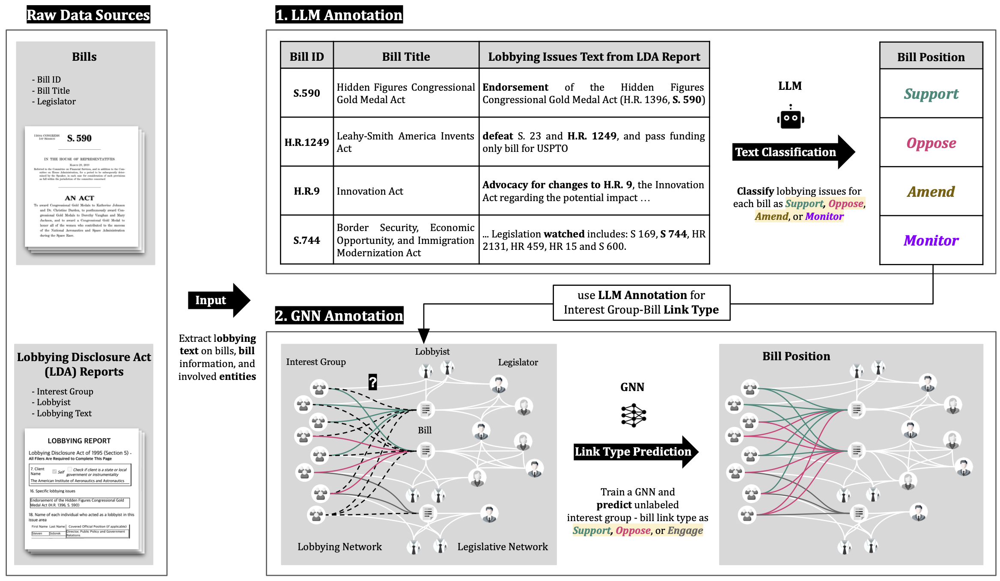

# Measuring Interest Group Positions on Legislation: An AI-Driven Analysis of Lobbying Reports




## Overview
This repository contains the code and data for the paper:
**"Measuring Interest Group Positions on Legislation: An AI-Driven Analysis of Lobbying Reports"**.

The project is organized into five components. For details on the implementation and settings, please refer to the respective folders.

1. `llm_bill_position_pipeline`: Bill position annotation pipeline using large language model (LLM)
2. `gnn_bill_position_pipeline`: Bill position annotation pipeline using graph neural network(GNN)
3. `bill_position_dataset`: Bill Position Dataset Stats from LLM and GNN annotation
4. `lobbying_position_score`: Scripts for generating the Lobbying Position Score based on the annotated bill position dataset
5. `analysis`: Scripts and data used to generate and analyze the figures in the paper (e.g., Analysis 1-4)

## Install

#### Full Install
We use `Python 10` environment on `Ubuntu 22.04`. To set up the entire environment and run all the code, execute the command below.

```bash
pip install -r requirements.txt
```
---

#### Install only for **LLM_annotation** or **Analysis**
If you only want to run the LLM annotation or analysis components, installing the following packages is sufficient.
```bash
pip install pandas
pip install matplotlib
pip install seaborn
pip install scipy
pip install joblib
pip install statsmodels

pip install scikit-learn
pip install tqdm 
pip install easydict 
pip install backoff 
pip install openai

pip install jupyterlab
jupyter lab password 
```


For other installation instructions related to other `GNN_annotation` or `lobbying position score`, please refer to each folder.


## Contact
Please contact jiseon_kim@kaist.ac.kr or raise an issue in this repository.
